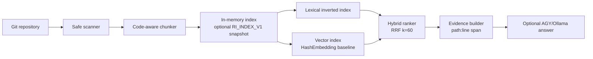

# Repository Intelligence

Repository Intelligence is a local Rust service that turns a Git repository into citable evidence: it scans source and documentation, creates code-aware chunks, supports lexical and vector retrieval, fuses both rankings, and supplies grounded context to an optional LLM answer provider.

It is deliberately a small, inspectable system rather than a collection of opaque AI calls.

## Why it exists

Repository questions are easy to answer incorrectly when a model guesses from a partial checkout. This project keeps the retrieval path deterministic and observable. Every source-search result carries a repository-relative path and line span, and an answer is refused when the repository has no lexical anchor for the question.

## Architecture



The library keeps the embedding provider behind the `EmbeddingProvider` trait. The checked-in provider (`HashEmbedding`) is a deterministic offline vector baseline; it has no model download, network call, or vendor lock-in. A learned local or hosted provider can be supplied through the same trait without changing indexing or ranking code.

## Quick start

```bash
cargo test --locked
cargo run --locked -- . "bounded worker"
cargo run --locked -- --semantic . "incremental indexing"
cargo run --locked -- --hybrid . "what does reload do"
cargo run --locked -- --commits . "authentication"
cargo run --locked -- --analytics .
```

The default command is the compatibility lexical baseline and prints `path:line<TAB>source`. Semantic and hybrid commands print `path:line[-end]<TAB>score<TAB>source`.

Create a reusable on-disk index when a repository is large or queried repeatedly:

```bash
cargo run --locked -- --index /path/to/repository /tmp/repository-intelligence.index
cargo run --locked -- --load-index /tmp/repository-intelligence.index "incremental indexing"
```

The format stores source text, a revision marker, and recent commit metadata, uses hex-encoded fields, and recomputes vectors through the configured provider on load. It stores repository-relative paths and adds no credentials or absolute-path metadata; source files should still be treated as potentially sensitive.

## Grounded answers

With the authenticated `agy` CLI:

```bash
cargo run --locked -- --answer . "What does the reload endpoint do?"
```

The command builds hybrid evidence, sends only that evidence to the provider, records model/duration metadata, and screens returned `path:line` citations against the retrieved spans. If no lexical evidence exists it prints:

```text
Insufficient repository evidence to answer this question.
```

`USE_OLLAMA=1 OLLAMA_MODEL=llama3` selects the local Ollama provider. Providers receive repository content as untrusted data; source-file instructions are never treated as system instructions.

## Local HTTP API

```bash
cargo run --locked -- --serve 127.0.0.1:8080 .
curl http://127.0.0.1:8080/health
curl 'http://127.0.0.1:8080/search?q=incremental+indexing'
curl 'http://127.0.0.1:8080/commits?q=authentication'
curl http://127.0.0.1:8080/reload
```

`/search` returns hybrid evidence with `path`, `start_line`, `end_line`, `score`, `source`, `kind`, and text, plus the indexed commit. `/commits` searches the last 100 commit subjects and dates, enabling lightweight commit-aware questions. `/reload` applies Git added/modified/deleted/renamed paths; a dirty worktree is refreshed by file hash. This is a local development API: authentication, TLS, rate limiting, and multi-tenant isolation are not implemented.

## Incremental indexing and safety

- Full scans skip Git/build/dependency directories, binary extensions, symlinks, and common credential/key names.
- Each file has a stable content hash. `sync_worktree` hashes eligible files, re-indexes only changed/new files, and removes deleted files.
- `sync_git` understands add, modify, delete, copy, type-change, and rename statuses; it falls back to a worktree refresh when Git history is unavailable.
- The last 100 commit IDs, dates, and subjects are retained as metadata and can be searched independently; this is not a full historical blob index.
- Chunks preserve file, function/struct/class/trait/impl declarations when a lightweight parser can identify them; 40-line generic chunks are the fallback.
- Absolute paths, parent traversal, symlink components, and sensitive file names are rejected for incremental updates.

Sensitive-name matching is ASCII case-insensitive (for example `CREDENTIALS.JSON` cannot bypass the policy). These checks reduce accidental leakage; they are not a substitute for a secret scanner or an adversarial filesystem boundary.

## Evaluation

The fixed authored corpus in `evaluation/corpus/` and questions in `evaluation/questions.json` are a regression suite, not a general quality claim.

```bash
python3 evaluation/evaluate.py
python3 evaluation/evaluate_modes.py
```

The separate `evaluation/evaluate_hybrid.py` experiment compares local Ollama `nomic-embed-text` embeddings with the product modes. It requires a running Ollama service and is intentionally not part of CI.

The current run on 20 file-level questions produced:

| mode | Hit/Recall@5 | MRR |
| --- | ---: | ---: |
| lexical | 1.00 | 1.0000 |
| semantic (`hash-token-v1`) | 1.00 | 0.9375 |
| hybrid (RRF, `k=60`) | 1.00 | 1.0000 |

The corpus is authored to test plumbing and determinism. It does not establish retrieval quality on arbitrary repositories, and the hashed vector baseline is not a trained language embedding model.

## Tests and development checks

```bash
cargo fmt --check
cargo check --locked --all-targets
cargo clippy --locked --all-targets -- -D warnings
cargo test --locked
./scripts/validate.sh
```

The Rust suite covers line retrieval, code-aware evidence, semantic/hybrid ranking, persistence round trips, Git synchronization, file removal, unanswerable questions, and sensitive-file policy consistency. Optional AGY and prompt-injection smoke tests are kept separate from normal CI because they require an external model CLI.

## Current limitations and roadmap

- `HashEmbedding` is an offline vector baseline. A learned embedding provider and a benchmark on a larger, independently held-out corpus are the next retrieval milestone.
- The lightweight declaration parser is intentionally conservative; language-specific AST chunkers are not yet bundled.
- Commit metadata search is limited to the last 100 commit IDs, dates, and subjects; historical file-level blame and full commit-blob retrieval are not included.
- The HTTP server is single-threaded and local-only.
- LLM answer quality and citation support require a provider-specific evaluation; retrieval metrics alone do not prove grounded generation.

## License

MIT. The evaluation corpus is authored for this project and contains no private repository content.
