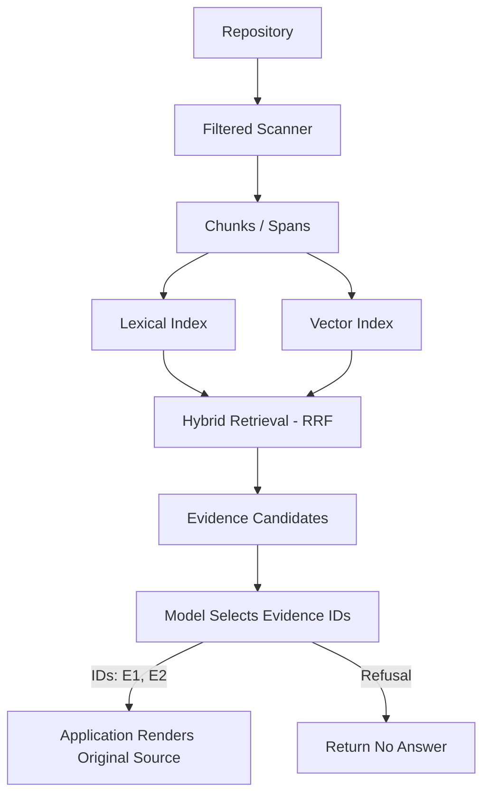

<p align="center">
  <h1 align="center">Repository Intelligence</h1>
  <p align="center">
    Evidence-first repository retrieval in Rust — local lexical, neural and hybrid search
    with an inspectable extractive answer contract.
  </p>
</p>

<p align="center">
  <a href="https://github.com/rustfuture/repository-intelligence/actions/workflows/ci.yml"></a>
  
  <a href="LICENSE"></a>
  
</p>

<p align="center">
  <a href="#at-a-glance">At a Glance</a> ·
  <a href="#architecture">Architecture</a> ·
  <a href="#quick-start">Quick Start</a> ·
  <a href="#measured-results">Results</a> ·
  <a href="#reproducibility">Reproducibility</a> ·
  <a href="#limitations">Limitations</a>
</p>

A local Rust repository index with lexical, vector and hybrid retrieval, source-line
citations, incremental updates, and model-assisted **source selection**. The model never
writes the answer: it returns evidence IDs and the application renders the original source.

## At a Glance

| | |
|---|---|
| Language | Rust 1.85+ (edition 2021), `cargo` only |
| Retrieval | Lexical + vector indexes fused by reciprocal rank (hybrid) |
| Embeddings | Deterministic `HashEmbedding` by default; optional Nomic via Ollama |
| Answering | `extractive-selection-v1`: evidence IDs in, verbatim source lines out |
| Models | Local Ollama (`qwen2.5-coder:1.5b`, `nomic-embed-text`) or the AGY adapter |
| Evaluation | 42-question v3 regression with committed raw records and manifests |
| Tests | 37 Rust tests + 5 Python evaluator tests (run in CI) |

## Architecture



Files are scanned through a sensitivity filter into line-addressed chunks. Lexical and
vector indexes feed a hybrid retriever; the model sees labelled evidence and may only
select IDs. The application validates each ID, checks the declared span against the
quoted text, and renders the original lines. Free-form prose and mixed valid/invalid
selections are refused atomically.

The local HTTP service exposes `/health`, `/search?q=...`, `/commits?q=...` and `/reload`.
It has no TLS, auth, or multi-tenant isolation — bind it to loopback. Git synchronization
handles changed and deleted files and marks dirty worktrees; a dirty label alone is not an
immutable snapshot identifier.

## Quick Start

Requires Rust 1.85+. Neural embeddings and model-assisted answers additionally require an
already running Ollama daemon with `nomic-embed-text` and `qwen2.5-coder:1.5b`.

```sh
cargo build --locked

# 1. Index a repository (default retrieval uses deterministic HashEmbedding)
cargo run --locked -- --index evaluation/corpus /tmp/ri.ri

# 2. Retrieve evidence without calling a model
cargo run --locked -- --semantic evaluation/corpus "index header"
cargo run --locked -- --hybrid   evaluation/corpus "index header"

# 3. Extractive answer: the model returns evidence IDs, the app renders the source
USE_OLLAMA=1 cargo run --locked -- --answer evaluation/corpus "What static string does reload return in api.rs?"

# 4. Machine-readable answer record
USE_OLLAMA=1 cargo run --locked -- --answer-json evaluation/corpus "What static string does reload return in api.rs?"
```

Default retrieval uses deterministic `HashEmbedding` (not a learned model).
`RI_EMBEDDING_PROVIDER=nomic` selects local neural embeddings. `USE_OLLAMA=1` selects
Ollama; without it the existing AGY adapter is used. No automatic hash fallback is claimed
when a selected neural provider fails.

## Answer Contract

`--answer` and `--answer-json` use `extractive-selection-v1`. The model returns only
evidence IDs. The application validates every ID and renders the original source text with
file/line references. Extra prose, invalid IDs, and mixed valid/invalid output are refused.

**An exact quotation is not proof that a source is true or answers the question.**
Selections may be irrelevant; malicious repository text may be quoted as data; the local
model can make false selections or refuse useful sources. Output is labelled as source
excerpts, not verified factual answers. No shell or tool execution is granted to the
answering model.

## Measured Results

[Full v3 regression record](evaluation/v3/run-03/report.md): 42 previously exposed
questions — 30 answerable, 12 unanswerable; 41 model calls and 1 pre-model refusal. Local
Qwen and Nomic digests, corpus, questions and source hashes are recorded in the manifest.

| Outcome | Count |
|---|---:|
| Expected source fully covered | 21 |
| Irrelevant selection | 5 |
| Partial source coverage | 2 |
| False refusal | 2 |
| Correct refusal on unanswerable questions | 7 |
| False selection on unanswerable questions | 5 |

Derived from the same raw records: **12 false accepts** (5 irrelevant + 2 partial + 5
selections on unanswerable questions) and **2 false rejects**. These are the numbers the
old single "refusal accuracy" figure hid.

All accepted excerpts matched their source text in this run — that is quotation integrity,
**not** answer correctness. Source-overlap scoring uses frozen expected spans and does not
establish entailment. The corpus is small, authored, and previously exposed: this is
regression evidence, not an unseen generalization benchmark.

The committed HTTP benchmark (`evaluation/v3/benchmark-local-http.json`) measures 200
sequential localhost requests on the fixed authored corpus at p50 0.857 ms / p95 0.920 ms.
It measures request overhead on that setup only, not generation latency.

## Reproducibility

```sh
cargo fmt --check
cargo check --locked --all-targets
cargo clippy --locked --all-targets -- -D warnings
cargo test --locked
python3 -m unittest discover -s evaluation/v3 -p 'test_*.py'
```

Reproduce the evaluation into a new directory (existing outputs are never overwritten):

```sh
python3 evaluation/v3/evaluate.py --output evaluation/v3/my-run
python3 evaluation/v3/evaluate.py --render-only evaluation/v3/my-run   # re-render, no model calls
```

`summary.json` reports true numerators and denominators and separates `false_accepts`,
`false_rejects`, `model_called` and `pre_model_refusals`. A pre-model refusal means the
index had no lexical anchor and the model was never called — a fact about the index, not
model or guard refusal accuracy. Old v1/v2 reports are historical; their 12/12 refusal and
universal injection-defense claims are superseded. Retrieval and generation metrics are
never pooled.

## Limitations

- **Quotation integrity is not correctness.** Matching source text proves the excerpt
  exists; it does not prove the excerpt answers the question.
- **Small, authored, previously exposed corpus.** The 42 v3 questions are regression
  evidence, not an unseen benchmark.
- **Generic overlap scoring.** Expected spans are frozen and overlap-based; entailment is
  not measured automatically.
- **No isolation.** The HTTP service has no TLS, auth, or tenant separation. Bind to
  loopback.
- **A synthesis or NLI layer would need its own evaluation.** A larger model or an NLI
  judge does not by itself guarantee correctness.

<details>
<summary>Design references</summary>

- [ALCE (EMNLP 2023)](https://aclanthology.org/2023.emnlp-main.398/) — citation presence
  and citation support are different evaluation dimensions.
- [Anthropic long-context experiments](https://www.anthropic.com/news/prompting-long-context) —
  quote extraction can make source use more inspectable.

</details>

## Repository Map

| Path | Contents |
|---|---|
| `src/lib.rs` | Index, retrieval modes, git sync, evidence assembly |
| `src/extractive.rs` | `extractive-selection-v1` validation and rendering |
| `src/llm.rs` | Ollama and AGY provider adapters |
| `src/main.rs` | CLI and local HTTP service |
| `tests/ri_regression.rs` | End-to-end regression tests |
| `evaluation/corpus/` | Authored Rust/Markdown corpus |
| `evaluation/v3/` | Evaluator, questions, and committed run records |
| `docs/architecture.md` | Component and trust boundaries |

## License

MIT — see [LICENSE](LICENSE). The evaluation corpus is authored for this project.
