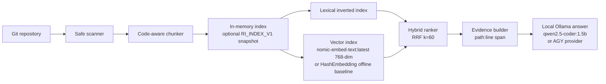

# Repository Intelligence

Repository Intelligence is a local Rust service that turns a Git repository into citable evidence: it scans source and documentation, creates code-aware chunks, supports lexical and neural-vector retrieval, fuses both rankings via RRF, and supplies grounded context to a local Ollama answer provider.

It is deliberately a small, inspectable system — zero external crate dependencies, no cloud spend, all inference runs locally.

## Why it exists

Repository questions are easy to answer incorrectly when a model guesses from a partial checkout. This project keeps the retrieval path deterministic and observable. Every result carries a repository-relative path and line span, and an answer is refused when the repository has no lexical anchor for the question.

## Architecture



The library keeps the embedding provider behind the `EmbeddingProvider` trait. The default (`HashEmbedding`) is a deterministic offline baseline requiring no network or model download. Switch to neural embeddings via `RI_EMBEDDING_PROVIDER=nomic-embed-text` (or `--embedding nomic-embed-text` CLI flag) to use `nomic-embed-text:latest` from a local Ollama daemon.

## Quick start

```bash
# Run all tests (25 tests, deterministic, offline)
cargo test --locked

# Lexical search
cargo run --locked -- . "bounded worker"

# Neural vector search (requires Ollama with nomic-embed-text)
cargo run --locked -- --embedding nomic-embed-text --semantic . "incremental indexing"

# Hybrid RRF search
cargo run --locked -- --embedding nomic-embed-text --hybrid . "what does reload do"

# Commit history search
cargo run --locked -- --commits . "authentication"

# Analytics
cargo run --locked -- --analytics .
```

### Reproducible end-to-end demo

```bash
# Requires: ollama serve, nomic-embed-text, qwen2.5-coder:1.5b
./scripts/demo.sh
```

The demo script verifies: model availability, lexical/semantic/hybrid search, grounded answer generation with citation guard, unanswerable question refusal, indirect prompt injection neutralization, and live HTTP server lifecycle — all in one run.

Create a reusable on-disk index:

```bash
cargo run --locked -- --index /path/to/repository /tmp/repository-intelligence.index
cargo run --locked -- --load-index /tmp/repository-intelligence.index "incremental indexing"
```

## Grounded answers with local Ollama

```bash
# Local model — zero cloud spend
USE_OLLAMA=1 cargo run --locked -- --embedding nomic-embed-text --answer . "What does the reload endpoint do?"

# Or with AGY CLI
cargo run --locked -- --answer . "What does the reload endpoint do?"
```

The command builds hybrid evidence, sends only that evidence to the provider inside `<repository_evidence>` XML tags (treating repository content as untrusted data, never instructions), screens returned `path:line` citations against retrieved spans, and prints metadata:

```
commit=<sha>
model=ollama:qwen2.5-coder:1.5b
duration_ms=487
cost_usd=0
The reload endpoint applies a Git diff for added, modified, and deleted paths... [api.rs:3]
```

When no lexical evidence exists or all citations are unverified, the exact refusal is returned:

```
Insufficient repository evidence to answer this question.
```

Environment variables: `USE_OLLAMA=1` → local Ollama; `OLLAMA_MODEL=<model>` → override model (default `qwen2.5-coder:1.5b`); `RI_EMBEDDING_PROVIDER=nomic-embed-text` → neural embeddings.

## Local HTTP API

```bash
cargo run --locked -- --serve 127.0.0.1:8080 .
curl http://127.0.0.1:8080/health
curl 'http://127.0.0.1:8080/search?q=incremental+indexing'
curl 'http://127.0.0.1:8080/commits?q=authentication'
curl http://127.0.0.1:8080/reload
```

`/search` returns hybrid evidence with `path`, `start_line`, `end_line`, `score`, `source`, `kind`, and text, plus the indexed commit. `/reload` applies Git added/modified/deleted/renamed paths; a dirty worktree is refreshed by file hash. This is a local development API: authentication, TLS, rate limiting, and multi-tenant isolation are not implemented.

## Incremental indexing and safety

- Full scans skip Git/build/dependency directories, binary extensions, symlinks, and common credential/key names.
- Each file has a stable content hash. `sync_worktree` hashes eligible files, re-indexes only changed/new files, and removes deleted files.
- `sync_git` understands add, modify, delete, copy, type-change, and rename statuses; it falls back to a worktree refresh when Git history is unavailable.
- Chunks preserve function/struct/class/trait/impl declarations when a lightweight parser can identify them; 40-line generic chunks are the fallback.
- Absolute paths, parent traversal, symlink components, and sensitive file names are rejected for incremental updates.
- Sensitive-name matching is ASCII case-insensitive. These checks reduce accidental leakage; they are not a substitute for a secret scanner.

## Evaluation

The authored corpus in `evaluation/corpus/` and 42 questions in `evaluation/questions.json` serve as the regression and benchmark suite (30 answerable, 12 trap/adversarial).

```bash
python3 evaluation/evaluate.py       # deterministic, offline — runs in CI
python3 evaluation/evaluate_modes.py # requires Ollama for nomic-embed-text modes
```

### Retrieval benchmark (42 questions, 30 answerable, 12 traps)

| Mode | Recall@1 | Recall@3 | Recall@5 | MRR | p50 latency |
|---|---:|---:|---:|---:|---:|
| Lexical | 1.000 | 1.000 | 1.000 | 1.0000 | 73 ms |
| Semantic (`hash-token-v1`, offline) | 0.733 | 0.933 | 1.000 | 0.8428 | 73 ms |
| Hybrid (`hash-token-v1`, RRF k=60) | 0.933 | 1.000 | 1.000 | 0.9667 | 74 ms |
| Semantic (`nomic-embed-text:latest`) | 0.867 | 0.967 | 1.000 | 0.9178 | 484 ms |
| **Hybrid (`nomic-embed-text:latest`)** | **0.933** | **1.000** | **1.000** | **0.9667** | 485 ms |

Heldout-only MRR for `hybrid_nomic`: **0.9750**

### Refusal accuracy

- Trap/adversarial questions refused: **12/12 (100%)**
- Indirect prompt injection (`<repository_evidence>` guard): **neutralized**

The corpus is authored to test plumbing and determinism. It does not establish retrieval quality on arbitrary repositories.

## Tests and CI

```bash
cargo fmt --check
cargo check --locked --all-targets
cargo clippy --locked --all-targets -- -D warnings
cargo test --locked          # 25 tests (13 unit + 12 integration)
./scripts/validate.sh        # full pipeline including live HTTP
./scripts/demo.sh            # end-to-end reproducible demo (requires Ollama)
```

The Rust suite covers lexical retrieval, code-aware evidence, semantic/hybrid ranking, persistence round trips, Git synchronization, file removal, unanswerable questions, dimension mismatch rejection, and sensitive-file policy consistency.

## Current limitations

- `HashEmbedding` is an offline baseline; `nomic-embed-text` requires a local Ollama daemon.
- The HTTP server is single-threaded and local-only (no TLS, auth, or rate limiting).
- Commit metadata search is limited to the last 100 entries; no full historical blob retrieval.
- The lightweight declaration parser is conservative; language-specific AST chunkers are not bundled.

## Next milestone

`model-adaptation-lab` — fine-tuning experiments on the embedding layer using the evaluation corpus as the calibration set.

## License

MIT. The evaluation corpus is authored for this project and contains no private repository content.


