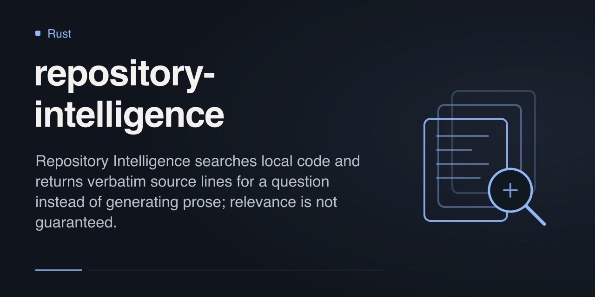
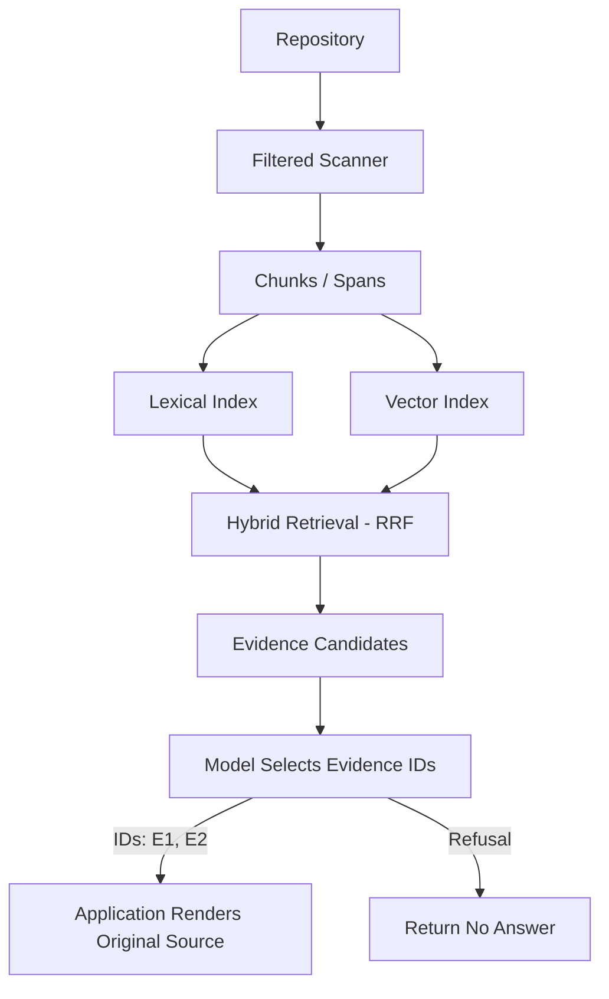

# Repository Intelligence



Repository Intelligence searches local code and returns verbatim source lines for a question instead of generating prose; relevance is not guaranteed.

[](https://github.com/rustfuture/repository-intelligence/actions/workflows/ci.yml)
[](LICENSE)

> [!NOTE]
> **Status:** Experimental research prototype (v0.1.0) for local code inspection.

- Searches code using text matching, offline hash embeddings, or local neural models.
- Responds to questions by quoting exact source lines instead of generating text; quotes match the source, but relevance is not guaranteed.
- Stores portable repository index snapshots without external database dependencies.
- Synchronizes file additions, changes, and deletions incrementally through Git diffs.
- Exposes local search and index reload endpoints over a lightweight HTTP server.

## Quick start

You need Git and Rust 1.85+ with Cargo ([rustup](https://rustup.rs/)). The first build downloads Cargo dependencies. Offline commands use a deterministic `HashEmbedding` provider without external services. Neural embeddings and model-assisted answers use a local Ollama service (`nomic-embed-text` and `qwen2.5-coder:1.5b`) or the AGY adapter (the Google Antigravity command-line client).

```sh
git clone https://github.com/rustfuture/repository-intelligence.git
cd repository-intelligence

# Build binary
cargo build --locked

# View available CLI options and modes
cargo run --locked -- --help

# 1. Index a repository (default retrieval uses deterministic HashEmbedding)
cargo run --locked -- --index evaluation/corpus /tmp/ri.ri

# 2. Retrieve evidence offline without calling a model
cargo run --locked -- --semantic evaluation/corpus "index header"
cargo run --locked -- --hybrid   evaluation/corpus "index header"

# 3. Query a saved snapshot
cargo run --locked -- --load-index /tmp/ri.ri "index header"
```

The offline examples print file and line references from the bundled corpus; the snapshot is written to `/tmp/ri.ri`. No API key, running model service, or model weights are needed for those examples. Run them from the repository root. These commands use macOS/Linux paths; choose a local snapshot path on Windows.

### Optional model-assisted answers

Start Ollama and download `qwen2.5-coder:1.5b` before running these commands. See [the Ollama quickstart](https://docs.ollama.com/quickstart) for installation. This step needs model weights and is separate from the offline examples.

```sh
# Extractive answer: the model returns evidence IDs, the app renders the source
USE_OLLAMA=1 cargo run --locked -- --answer evaluation/corpus "What static string does reload return in api.rs?"

# Machine-readable answer record
USE_OLLAMA=1 cargo run --locked -- --answer-json evaluation/corpus "What static string does reload return in api.rs?"
```

Default retrieval uses deterministic `HashEmbedding` (not a learned model).
`RI_EMBEDDING_PROVIDER=nomic` selects local neural embeddings. `USE_OLLAMA=1` selects
Ollama; without it the AGY adapter (Google Antigravity command-line client) is used.
No automatic hash fallback occurs when a selected neural provider fails.

## Architecture


```mermaid
flowchart TD
    R[Repository] --> S[Filtered Scanner]
    S --> C[Chunks / Spans]
    C --> L[Lexical Index]
    C --> V[Vector Index]
    L --> H[Hybrid Retrieval - RRF]
    V --> H
    H --> E[Evidence Candidates]
    E --> M[Model Selects Evidence IDs]
    M -->|IDs: E1, E2| O[Application Renders Original Source]
    M -->|Refusal| N[Return No Answer]
```

- A repository scanner filters binary and sensitive files, then chunks source files into line-addressed spans.
- Lexical matching and vector embeddings index chunks, and reciprocal rank fusion combines candidate scores.
- Top candidates are formatted into numbered evidence blocks (`[E1]`, `[E2]`) and passed to the model prompt.
- The model selects only evidence identifiers and cannot return free-form prose.
- The application verifies selected identifiers and displays original source lines directly from disk.

For component details, trust boundaries, and system overview, see [docs/architecture.md](docs/architecture.md).

## Answer Contract

The `--answer` and `--answer-json` commands use `extractive-selection-v1`. The model returns only
evidence IDs. The application validates each ID and renders original source text with
file and line references. Extra prose, invalid IDs, and mixed valid/invalid output are refused atomically.

An exact quotation is not proof that a source is true or answers the question.
Selections may be irrelevant, and repository text is treated as untrusted data. Output is labelled as source
excerpts, not verified answers. The model receives no shell or tool execution privileges.

## Measured Results

[Full v3 regression record](evaluation/v3/run-03/report.md): 42 previously exposed
questions (30 answerable, 12 unanswerable; 41 model calls, 1 pre-model refusal).
Results yielded 12 false accepts (5 irrelevant, 2 partial, 5 on unanswerable questions)
and 2 false rejects, with 21 expected sources fully covered and 7 correct refusals.

Three runs of these 42 questions are committed (`evaluation/v3/run-01`, `run-02`, `run-03`).
Run-03 is reported here because it is the latest run and the only one made after the unused
`src/citation.rs` module was removed (commit `79fc4c1`, clean tree); run-01 was made on a dirty
working tree and run-02 on commit `63c1eba`. The runs differ: false accepts / expected sources
covered / false rejects are 12 / 18 / 3 (run-01), 8 / 23 / 3 (run-02) and 12 / 21 / 2 (run-03),
so run-02 is the best of the three and run-03 is not the most favourable. Run-01 and run-02 record
identical source, question and corpus hashes and model digests, so that spread is run-to-run
variation rather than a recorded code change; treat these counts as one sample, not a stable rate.

The committed HTTP benchmark (`evaluation/v3/benchmark-local-http.json`) measures 200
sequential localhost requests on the fixed authored corpus at p50 0.857 ms / p95 0.920 ms
(request overhead only, not generation latency).

All accepted excerpts matched source text (quotation integrity, not semantic correctness).
For the extended results table and historical notes, see [docs/measured-results.md](docs/measured-results.md).

## Reproducibility

Reproduce the evaluation into a new directory (existing outputs are never overwritten):

<details>
<summary>Reproduction details</summary>

```sh
python3 evaluation/v3/evaluate.py --output evaluation/v3/my-run
python3 evaluation/v3/evaluate.py --render-only evaluation/v3/my-run   # re-render, no model calls
```

The output `summary.json` separates `false_accepts`, `false_rejects`, `model_called`, and `pre_model_refusals`. A pre-model refusal indicates the index lacked a lexical anchor and the model was not called. Historical notes on superseded claims are relocated to [docs/measured-results.md](docs/measured-results.md).

</details>

## Tests

```sh
cargo fmt --check
cargo check --locked --all-targets
cargo clippy --locked --all-targets -- -D warnings
cargo test --locked
python3 -m unittest discover -s evaluation/v3 -p 'test_*.py'
python3 evaluation/evaluate.py
python3 evaluation/evaluate_modes.py
```

<details>
<summary>More test commands</summary>

The test suite validates formatting, static analysis, 37 Rust unit and regression tests covering indexing and retrieval, and 5 Python evaluator tests.

</details>

## Limitations

- **Quotation integrity is not correctness.** Matching source text proves the excerpt
  exists; it does not prove the excerpt answers the question.
- **Small, authored, previously exposed corpus.** The 42 v3 questions are regression
  evidence, not an unseen benchmark.
- **Generic overlap scoring.** Expected spans are frozen and overlap-based; entailment is
  not measured automatically.
- **No isolation.** The HTTP service has no TLS, auth, or tenant separation. Bind to
  loopback.
- **A synthesis or NLI layer would need its own evaluation.** A larger model or an NLI
  judge does not by itself guarantee correctness.

<details>
<summary>Design references</summary>

- [ALCE (EMNLP 2023)](https://aclanthology.org/2023.emnlp-main.398/) — citation presence
  and citation support are different evaluation dimensions.
- [Anthropic long-context experiments](https://www.anthropic.com/news/prompting-long-context) —
  quote extraction can make source use more inspectable.

</details>

## Repository Map

| Path | Contents |

<details>
<summary>Repository map</summary>

|---|---|
| `src/lib.rs` | Index, retrieval modes, git sync, evidence assembly |
| `src/extractive.rs` | `extractive-selection-v1` validation and rendering |
| `src/llm.rs` | Ollama and AGY provider adapters |
| `src/main.rs` | CLI and local HTTP service |
| `tests/ri_regression.rs` | End-to-end regression tests |
| `evaluation/corpus/` | Authored Rust/Markdown corpus |
| `evaluation/v3/` | Evaluator, questions, and committed run records |
| `docs/architecture.md` | Component and trust boundaries |

</details>

## License

MIT — see [LICENSE](LICENSE). The evaluation corpus is authored for this project.
